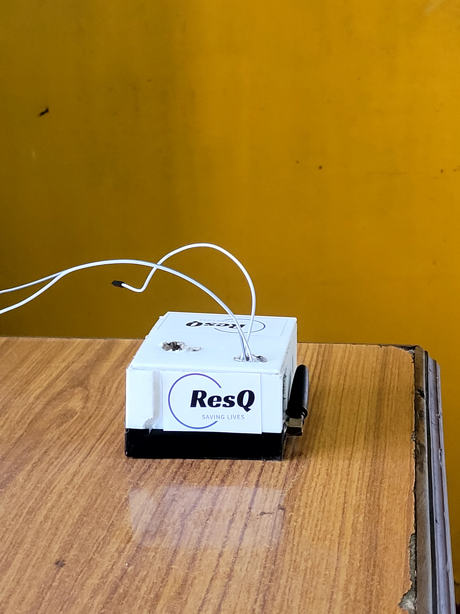

# ResQ – Instant Alerts, Instant Safety

An AI-based accident detection system for two-wheelers, built for Smart India Hackathon 2024 (Problem Statement ID: SIH1535, Hardware category). Team AARAMBH — **Winner, SIH 2024 Hardware Edition**, selected from 500+ national teams.

This is a hardware project, so there's no application code repo here — this repo holds the project writeup, circuit diagram, prototype photos, and presentation slides.

## The Problem

Most accident-safety devices in the market are built for four-wheelers. Two-wheeler riders — who make up a huge share of vehicles in India — are largely left without similar protection, and helmet usage alone isn't solving that.

## What ResQ Does

- **Accident detection** – an ADXL335 accelerometer watches for sudden changes in movement (x, y, z axes) that indicate a crash.
- **Instant SMS alert** – once a crash is detected, the Arduino sends an SMS through a SIM900A module to emergency contacts, hospitals, and police.
- **Live location sharing** – the alert includes a Google Maps link generated from a NEO-M8N GPS module.
- **Before/after photos** – an ESP32-CAM captures images around the time of the accident.
- **Cause analysis** – captured images are run through a YOLO-based model to help identify what caused the accident.
- **False-alarm safety** – a 30-second buzzer window lets the rider cancel a false trigger with a handlebar button before any alert goes out.
- **Companion app** – built in Flutter, with live vehicle tracking, driving-pattern insights, and an accident-hotspot map.

## Tech Stack

| Part | What we used |
|---|---|
| Microcontroller | Arduino Uno |
| Crash detection | ADXL335 accelerometer |
| Location | NEO-M8N GPS module |
| Alerts | SIM900A GSM module (SMS) |
| Camera | ESP32-CAM |
| Image analysis | YOLO |
| App | Flutter (Dart) |
| Database | NoSQL, real-time |
| Languages | C++, embedded C, Dart |

## How It Works

1. Accelerometer detects a sudden change that holds for 20+ seconds.
2. Microcontroller triggers a 30-second buzzer.
3. If the rider doesn't cancel it (handlebar button), an SMS with GPS location is sent to emergency contacts.
4. The ESP32-CAM captures images before, during, and after the event.
5. Images are stored and later analyzed to help determine the cause of the accident.

*(See `slides/ResQ-SIH2024.pdf` for the full process flow diagram.)*

## Prototype

Working hardware prototype built and tested on Arduino Uno with the sensors listed above.

## Project Materials

- Full SIH 2024 presentation: [`slides/ResQ.pdf`](slides/ResQ.pdf)
- Product explanation video: https://app.animaker.com/animo/GUAhx0ZOlHdeaOAz/

## Team AARAMBH
